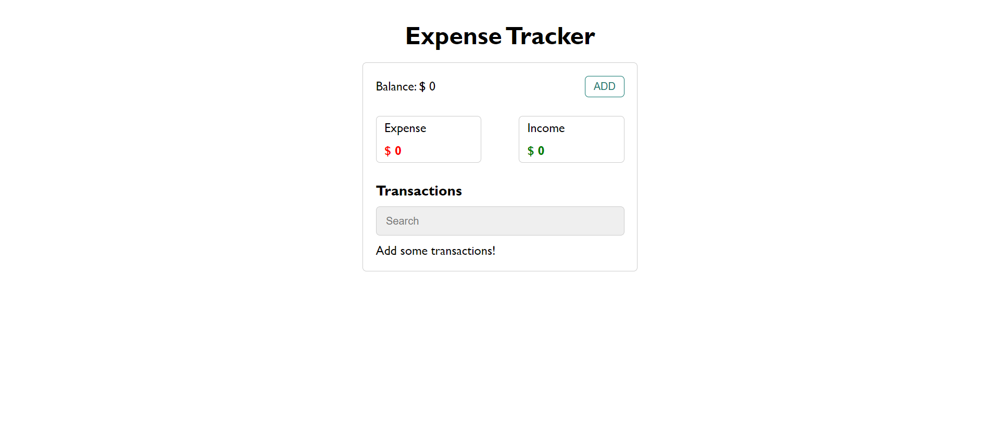
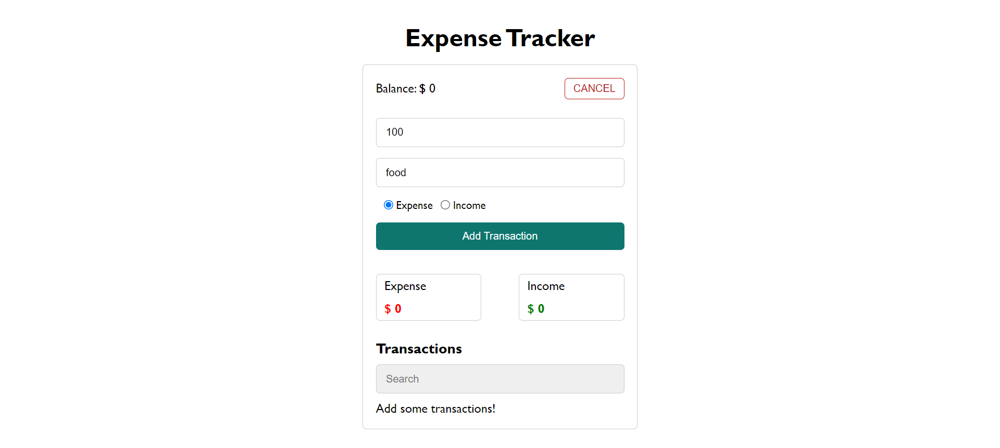
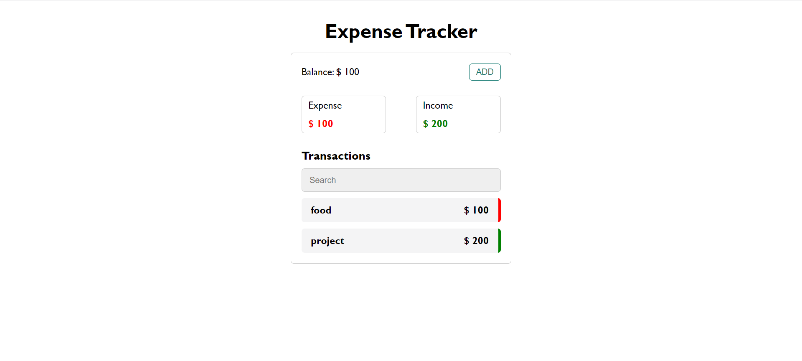

# ExpenseTracker_App

This project is a expense tracker app. In this app, user can add some transactions. Transactions can be expense or income. The balance is shown at the top. User can search in transactions. Demo on [Vercel](https://expense-tracker-seven-ruby.vercel.app/).

## Technologies

- HTML5
- CSS3
- React.js

## Screenshots

## Getting Started with Create React App

This project was bootstrapped with [Create React App](https://github.com/facebook/create-react-app).

## Available Scripts

In the project directory, you can run:

### `npm install`

Installs the packages needed in this project.

### `npm start`

Runs the app in the development mode.\
Open [http://localhost:3000](http://localhost:3000) to view it in your browser.

The page will reload when you make changes.\
You may also see any lint errors in the console.

